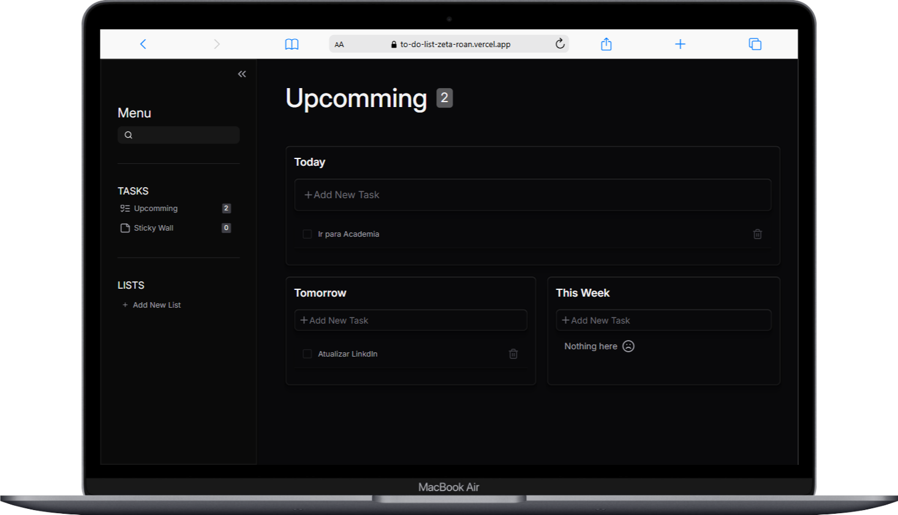

<h1 align="center">📝 To-Do List Project</h1> 
<h2>📜 Project Description</h2> 

 
Welcome to my To-Do List application!

This project is designed to help users organize their tasks and notes in a practical and efficient way. Built with React, TypeScript, and TailwindCSS, it provides a dynamic and responsive user interface, ensuring a smooth experience across devices.

 
<h2>📆 Key Features</h2> 

 
✔️ **Task Management**: Create, update, and manage tasks with an intuitive interface. Tasks can be categorized into specific lists, making it easy to stay organized.

🗒️ Sticky Notes:
Add, edit, and remove personalized sticky notes with customizable colors for quick reminders or important information.

📂 List Organization:
Create and manage multiple lists, each with its own tasks. Add tasks to specific lists and keep track of them effortlessly.

⚙️ Dynamic State Management:
State is efficiently managed using React Context API, ensuring seamless updates and interaction between components.

🎨 Modern Design:
Built with TailwindCSS, the application features a visually appealing, responsive, and easy-to-navigate design.

🔗 Routing:
Navigate between different sections of the app, such as home, lists, and sticky notes, with React Router for a smooth user experience.

 
<h2>🚀 Technologies Used</h2> 

    
    
    
    

<h2>🌟 Why This Project?</h2> 

 
This project showcases my skills as a developer, including: 
 

<ul> 
  <li>✅ Strong understanding of state management using Context API</li> 
  <li>✅ Dynamic component design with React and TypeScript</li> 
  <li>✅ Integration of modern styles using TailwindCSS</li> 
  <li>✅ Routing and modular structure for scalability</li> 
</ul>

### 📸 **Preview**

